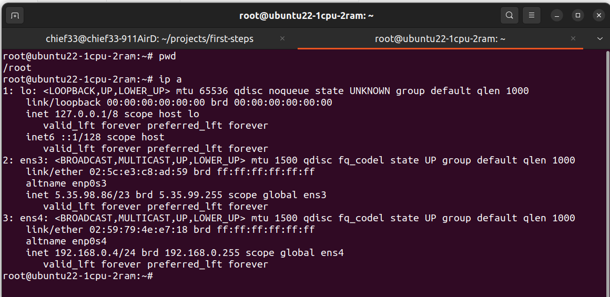
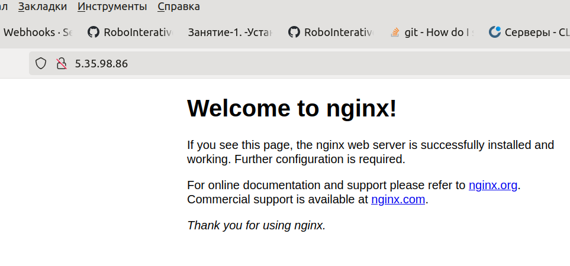
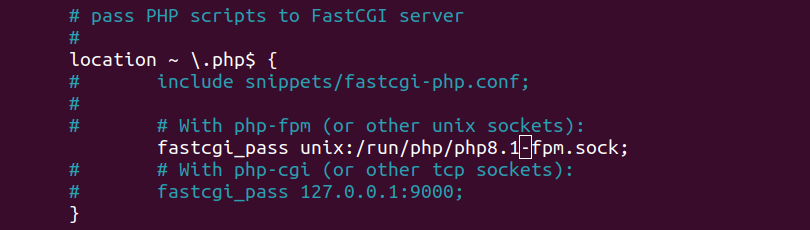

Занятие-1. -Установка nginx + php-fpm
-------------------------------------

Справка по командам
```````````````````

+-------------+-------------------+---------------------------------------------+
|     имя     |  пример           |      описание                               |
+=============+===================+=============================================+
| cd          | cd /home          | Изменить текущую директорию                 |
+-------------+-------------------+---------------------------------------------+
| apt         | apt update        | Обновить заголовки пакетов                  |
|             |                   |                                             |
|             | apt upgrade       | Обновить все пакеты в системе               |
|             |                   |                                             |
|             | apt install nginx | Установка пакета                            |
+-------------+-------------------+---------------------------------------------+
|   cd        | cd /home          | Изменить текущую директорию                 |
+-------------+-------------------+---------------------------------------------+
|    ls       | ls -li            | Просмотр текущей директории                 |
+-------------+-------------------+---------------------------------------------+
|    pwd      | pwd               | Показать текущий путь                       |
+-------------+-------------------+---------------------------------------------+
|    ip       | ip a              | Показать ip адрес виртуальной машины        |
+-------------+-------------------+---------------------------------------------+


Справка по горячим клавишам nano
`````````````````````````````````

+-----------------+-------------------+-----------------------------------------+
|     имя         |                   |      описание                           |
+=================+===================+=========================================+
| ``CTRL + o``    |    Сохранить      | Изменить текущую директорию             |
+-----------------+-------------------+-----------------------------------------+
| ``CTRL + x``    | Выйти             | Обновить заголовки пакетов              |
+-----------------+-------------------+-----------------------------------------+
| ``CTRL + w``    |  поиск            |    ищет по слову                        |
+-----------------+-------------------+-----------------------------------------+
| ``CTRL + _``    |  перейти к        |  переход по номер строки                |
+-----------------+-------------------+-----------------------------------------+


Установка nginx
```````````````

Установка пакетов
'''''''''''''''''

Для установки nginx, нужно ввести следующие команды

.. code-block:: shell-session


   apt update && apt install -y nginx php-fpm

После ввода этой команды мы установим вебсервер nginx. Узнаем ip адрес. И вобъем
его в браузер






В современных операционках и виртуальных машинах сетевые интерфейсы обычно
называются так

* **ens3**, **ens4** - интерфейсы сетевой платы,
* **lo** - виртуальный интерфей   локальной(внутренней сети localhost),
* **br**, **docker0** - сетевой мост и интерфейсы сети докер
* **wlp4s0** -  WIFI сетевой интерфейс

В нашем случае **ens3** -смотрит на внешню сеть -Интернет, а ens4 смотрит
на внутренню сеть.

Изменить конфигурацию
'''''''''''''''''''''

В linux Все конфигурационные файлы лежат в папке /etc
для нашей программы это /etc/nginx

перейдет в каталог ``/etc/nginx/sites-available`` и отредактируйте **default**

.. code-block:: shell-session


   cd /etc/nginx/sites-available
   nano default

Изменить конфигурационный файл , как нарисунке.




Для проверки php давайте сделаем тестовый php файлы
.. code-block:: shell-session


        nano /var/www/html/test.php


Со следующим содержимым.

.. code-block:: php


        <?php
        phpinfo();
        ?>


Сохранить и выйти ``CTRL+o`` затем ``CTRL+x``

Для применения конфигурации, требуется перезагрузить **nginx**

.. code-block:: shell-session


   systemctl restart nginx


Для проверки **nginx**

.. code-block:: shell-session


  systemctl status nginx
  journalctl -xe -u nginx
