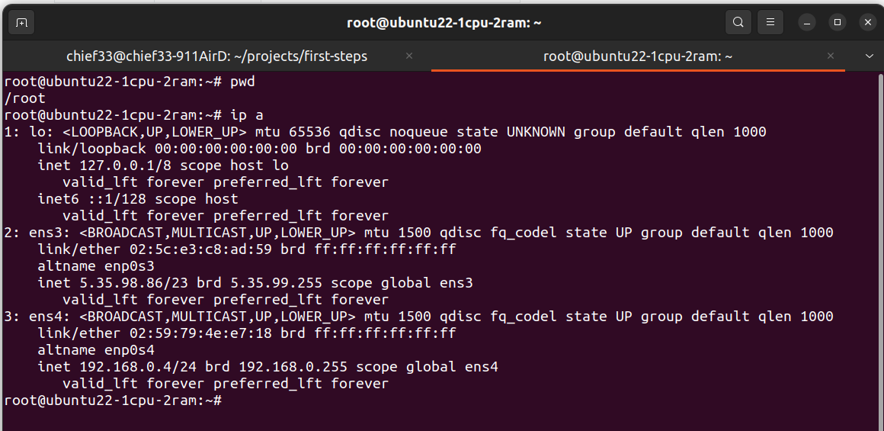
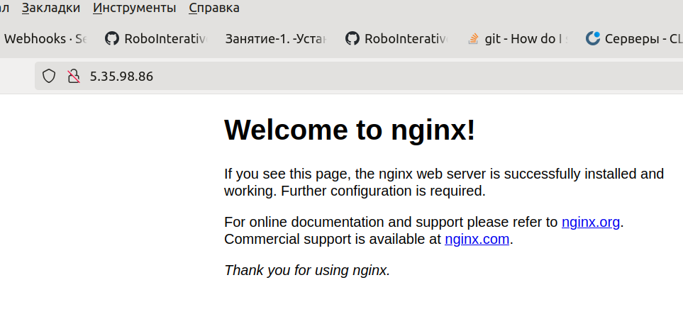

## Практическая часть


### Шаг 1: Подключение к серверу

```bash


   ssh root@<IP-адрес>
   # Введите пароль (не отображается при вводе)
```

### Шаг 2: Обновление пакетов и установка

```bash
   #Установка Nginx и PHP-FPM

   apt update
   apt install -y nginx php-fpm
```

**Пояснение:**
- ``update`` — обновляет список доступных пакетов
- ``-y`` — автоматически отвечает "yes" на все вопросы

### Шаг 3: Проверка IP-адреса

```console
   #Узнаём IP сервера

   ip a
```

Найдите интерфейс **ens3** (или eth0) — там будет ваш IP:




### Шаг 4: Проверка работы Nginx

Откройте браузер и введите полученный IP:




Если видите "Welcome to nginx" — всё работает!

### Шаг 5: Настройка Nginx для PHP

```bash
   #Редактируем конфигурацию

   cd /etc/nginx/sites-available/
   nano default
```

Найдите секцию ``location ~ \.php$`` и раскомментируйте её (уберите ``#``):


Также добавьте ``index.php`` в директиву ``index``.

### Шаг 6: Создание тестового PHP-файла

```bash
   #Создаём test.php

   nano /var/www/html/test.php
```
Вставьте содержимое:

```php

   <?php
   phpinfo();
   ?>
```


Сохраните (``Ctrl+O``, Enter) и выйдите (``Ctrl+X``).

### Шаг 7: Перезапуск Nginx

```bash
   #Применяем изменения

   systemctl restart nginx
```

### Шаг 8: Проверка PHP

Откройте в браузере: ``http://<IP-адрес>/test.php``

Вы должны увидеть страницу с информацией о PHP.

### Шаг 9: Проверка статуса и логов

```bash
   #Проверяем, что всё работает

   systemctl status nginx
   journalctl -xe -u nginx
```
### Типичные ошибки


| Ошибка | Решение |
|---------|---------|
|``Permission denied``|   Забыли ``sudo`` или неправильные права|
| ``Address already in use`` | Порт 80 уже занят (другой nginx или apache)|
| ``File not found`` в браузере |  Неправильный путь к файлу или не перезапустили nginx |
| PHP не обрабатывается (скачивается файл)| Неправильная конфигурация в default или неустановлен php-fpm |

### Вопросы для самопроверки


1. Как узнать IP-адрес сервера?
2. Какая команда устанавливает пакеты?
3. Где лежат конфиги Nginx?
4. Как перезапустить сервис?
5. Как посмотреть логи ошибок?
6. Что такое php-fpm и зачем он нужен?

### Домашнее задание


1. **Создать свой тестовый PHP-файл**, который выводит:
   - Текущую дату
   - Ваше имя
   - Случайное число

2. **Настроить второй сайт** (виртуальный хост):
   - Скопируйте ``default`` в ``site2``
   - Измените ``root`` на другую директорию
   - Создайте там простой HTML-файл
   - Сделайте симлинк в ``sites-enabled``

3. **Документировать** все шаги в своей wiki.

### Ссылки на документацию


* `Официальная документация Nginx <https://nginx.org/en/docs/>`_
* `PHP-FPM документация <https://www.php.net/manual/ru/install.fpm.php>`_
* `Руководство по nano <https://www.nano-editor.org/dist/latest/cheatsheet.html>`_
