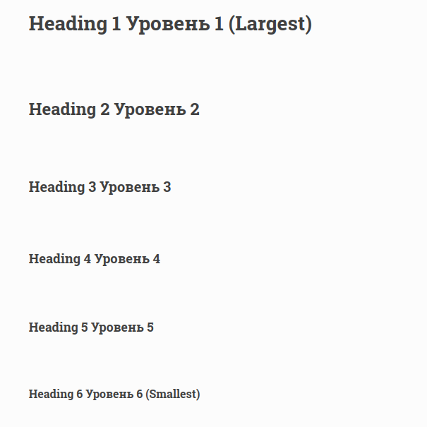
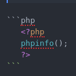
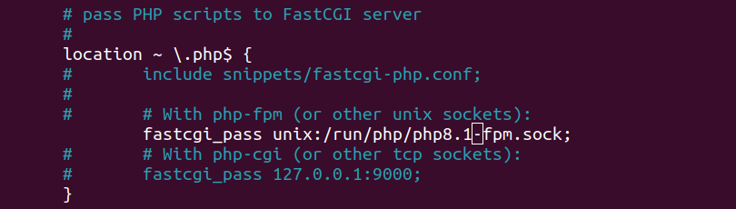
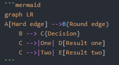
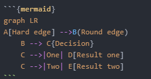

## Базовый синтаксис markdown

### Заголовки
**Так задается:**
```markdown
# Heading 1	Уровень 1 (Largest)	<h1>
## Heading 2	Уровень 2	<h2>
### Heading 3	Уровень 3	<h3>
#### Heading 4	Уровень 4	<h4>
##### Heading 5	Уровень 5	<h5>
###### Heading 6	Уровень 6 (Smallest)	<h6>
```

**Так отображается:**

-------------------------------------------------



-------------------------------------------------


### Подсветка кода
Для кода в тексте , например горячие клавиши

**Так задается:**

```markdown
Сохраните (``Ctrl+O``, Enter) и выйдите (``Ctrl+X``).
```

**Так отображается:**


Сохраните (``Ctrl+O``, Enter) и выйдите (``Ctrl+X``).


Для блока кода с Подсветкой синтаксиса

**Так задается:**



**Так отображается:**


 ```php       
   <?php
   phpinfo();
   ?>
```


### Ссылки


**Так задается:**
```markdown
My favorite search engine is [Duck Duck Go](https://duckduckgo.com "The best search engine for privacy").

```
Ниже как будет выглядеть текст со ссылкой


**Так отображается:**

My favorite search engine is [Duck Duck Go](https://duckduckgo.com "The best search engine for privacy").

### Картинки

**Так задается:**

```markdown

```

**Так отображается:**


### Таблицы

**Так задается:**

```markdown
| Ошибка | Решение |
|---------|---------|
|``Permission denied``|   Забыли ``sudo`` или неправильные права|
| ``Address already in use`` | Порт 80 уже занят (другой nginx или apache)|
| ``File not found`` в браузере |  Неправильный путь к файлу или не перезапустили nginx |
| PHP не обрабатывается (скачивается файл)| Неправильная конфигурация в default или неустановлен php-fpm |
```
**Так отображается:**


| Ошибка | Решение |
|---------|---------|
|``Permission denied``|   Забыли ``sudo`` или неправильные права|
| ``Address already in use`` | Порт 80 уже занят (другой nginx или apache)|
| ``File not found`` в браузере |  Неправильный путь к файлу или не перезапустили nginx |
| PHP не обрабатывается (скачивается файл)| Неправильная конфигурация в default или неустановлен php-fpm |

### Диаграммы

**Так задается:**


**Если для Sphinx Myst**



Если для Gitlab ,Github markdown




**Так отображается:**


```{mermaid}
graph LR
A[Hard edge] -->B(Round edge)
    B --> C{Decision}
    C -->|One| D[Result one]
    C -->|Two| E[Result two]
```
