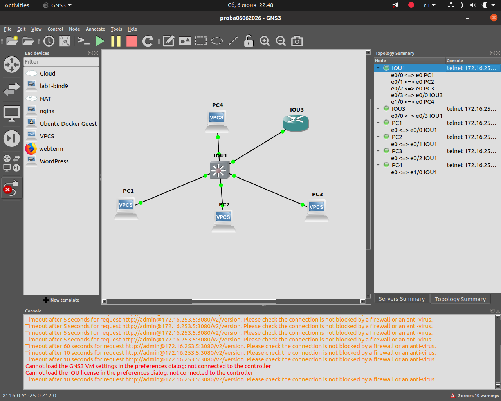

Ниже представлен готовый документ в формате **Markdown**, который полностью охватывает **текст задания** и **итоговое решение** с конфигурациями, проверками и ответами на вопросы. Вы можете сохранить его как `SOLUTION.md` и приложить к сдаче.

---

# Отчёт по заданию: «Изолированные клиенты с общим доступом к серверу»

## Цель работы

Настроить сеть, в которой три клиентских компьютера находятся в разных VLAN и **не имеют доступа друг к другу**, но каждый клиент **имеет доступ к общему серверу**.

---

## Топология сети



> *Скриншот топологии из GNS3 прилагается отдельным файлом.*

```
[PC1] ─── [L2 свитч IOU1] ─── [L3 роутер IOU3]
[PC2] ───        │
[PC3] ───        │
[Сервер PC4] ────┘
```

---

## IP-план

| Устройство | VLAN | IP-адрес | Маска | Шлюз |
|------------|------|----------|-------|------|
| PC1 | 10 | 10.0.10.10 | /24 | 10.0.10.1 |
| PC2 | 20 | 10.0.20.10 | /24 | 10.0.20.1 |
| PC3 | 30 | 10.0.30.10 | /24 | 10.0.30.1 |
| Сервер (PC4) | 100 | 10.0.100.20 | /24 | 10.0.100.1 |

---

## Конфигурации устройств

### 1. L2 свитч (IOU1)

```bash
vlan 10
 name PC1_VLAN
vlan 20
 name PC2_VLAN
vlan 30
 name PC3_VLAN
vlan 100
 name SERVER_VLAN
!
interface Ethernet0/0
 switchport mode access
 switchport access vlan 10
 duplex auto
!
interface Ethernet0/1
 switchport mode access
 switchport access vlan 20
 duplex auto
!
interface Ethernet0/2
 switchport mode access
 switchport access vlan 30
 duplex auto
!
interface Ethernet1/0
 switchport mode access
 switchport access vlan 100
 duplex auto
!
interface Ethernet0/3
 switchport trunk encapsulation dot1q
 switchport trunk allowed vlan 10,20,30,100
 switchport mode trunk
 duplex auto
!
end
write memory
```

### 2. L3 роутер (IOU3)

```bash
ip routing
!
interface Ethernet0/0
 no ip address
 no shutdown
!
interface Ethernet0/0.10
 encapsulation dot1Q 10
 ip address 10.0.10.1 255.255.255.0
 no shutdown
!
interface Ethernet0/0.20
 encapsulation dot1Q 20
 ip address 10.0.20.1 255.255.255.0
 no shutdown
!
interface Ethernet0/0.30
 encapsulation dot1Q 30
 ip address 10.0.30.1 255.255.255.0
 no shutdown
!
interface Ethernet0/0.100
 encapsulation dot1Q 100
 ip address 10.0.100.1 255.255.255.0
 no shutdown
!
access-list 100 deny ip 10.0.10.0 0.0.0.255 10.0.20.0 0.0.0.255
access-list 100 deny ip 10.0.10.0 0.0.0.255 10.0.30.0 0.0.0.255
access-list 100 deny ip 10.0.20.0 0.0.0.255 10.0.10.0 0.0.0.255
access-list 100 deny ip 10.0.20.0 0.0.0.255 10.0.30.0 0.0.0.255
access-list 100 deny ip 10.0.30.0 0.0.0.255 10.0.10.0 0.0.0.255
access-list 100 deny ip 10.0.30.0 0.0.0.255 10.0.20.0 0.0.0.255
access-list 100 permit ip any any
!
interface Ethernet0/0.10
 ip access-group 100 in
!
interface Ethernet0/0.20
 ip access-group 100 in
!
interface Ethernet0/0.30
 ip access-group 100 in
!
end
write memory
```

### 3. VPCS (клиенты и сервер)

**PC1:**
```bash
ip 10.0.10.10 255.255.255.0 10.0.10.1
save
```

**PC2:**
```bash
ip 10.0.20.10 255.255.255.0 10.0.20.1
save
```

**PC3:**
```bash
ip 10.0.30.10 255.255.255.0 10.0.30.1
save
```

**Сервер (PC4):**
```bash
ip 10.0.100.20 255.255.255.0 10.0.100.1
save
```

---

## Результаты проверки

### ✅ Успешные пинги

| Откуда | Куда | Результат |
|--------|------|-----------|
| PC1 | 10.0.10.1 (шлюз) | ✅ `icmp_seq=1 ttl=255 time=0.5 ms` |
| PC2 | 10.0.20.1 (шлюз) | ✅ `icmp_seq=1 ttl=255 time=0.6 ms` |
| PC3 | 10.0.30.1 (шлюз) | ✅ `icmp_seq=1 ttl=255 time=0.4 ms` |
| Сервер | 10.0.100.1 (шлюз) | ✅ `icmp_seq=1 ttl=255 time=0.5 ms` |
| PC1 | 10.0.100.20 (сервер) | ✅ `icmp_seq=1 ttl=255 time=0.8 ms` |
| PC2 | 10.0.100.20 (сервер) | ✅ `icmp_seq=1 ttl=255 time=0.7 ms` |
| PC3 | 10.0.100.20 (сервер) | ✅ `icmp_seq=1 ttl=255 time=0.9 ms` |

### ❌ Запрещённые пинги (между клиентами)

```
PC1> ping 10.0.20.10
10.0.10.1 icmp_seq=1 ttl=255 time=0.954 ms (ICMP type:3, code:13, Communication administratively prohibited)
```

```
PC1> ping 10.0.30.10
10.0.10.1 icmp_seq=1 ttl=255 time=0.850 ms (ICMP type:3, code:13, Communication administratively prohibited)
```

```
PC2> ping 10.0.10.10
10.0.20.1 icmp_seq=1 ttl=255 time=0.900 ms (ICMP type:3, code:13, Communication administratively prohibited)
```

> **Код 13** означает, что пакет запрещён административно (ACL).

---

## Ответы на вопросы

### 1. Почему клиенты в разных VLAN не видят друг друга?

> Клиенты находятся в разных VLAN, что обеспечивает изоляцию на **канальном уровне (L2)** — каждый VLAN представляет собой отдельный широковещательный домен.  
> Дополнительно на **роутере настроен ACL**, который блокирует пересылку IP-пакетов между подсетями клиентов, что обеспечивает изоляцию и на **сетевом уровне (L3)**.  
> Без ACL роутер по умолчанию пересылал бы трафик между VLAN, так как знает все маршруты к их подсетям.

### 2. Зачем нужен trunk между свитчом и роутером?

> Trunk позволяет передавать трафик **нескольких VLAN** через один физический интерфейс с использованием тегирования 802.1Q.  
> Без trunk пришлось бы подключать каждую VLAN отдельным кабелем к разным портам роутера, что неэффективно и не масштабируется.

### 3. Что произойдёт, если убрать `encapsulation dot1Q` на subinterface?

> Subinterface перестанет понимать VLAN-теги. Все входящие кадры с тегами будут отбрасываться, и связность для соответствующего VLAN полностью пропадёт.  
> Роутер не сможет обрабатывать трафик из этого VLAN, и клиенты потеряют доступ к своему шлюзу, а значит, и ко всем удалённым сетям.

### 4. Как изменить конфигурацию, чтобы PC1 и PC2 видели друг друга?

> Достаточно **удалить ACL** с интерфейсов роутера или добавить разрешающее правило между VLAN 10 и 20.  
> Пример удаления:
> ```bash
> interface e0/0.10
>  no ip access-group 100 in
> interface e0/0.20
>  no ip access-group 100 in
> ```
> После этого роутер начнёт пересылать пакеты между этими VLAN.

---

## Дополнительное задание (со звёздочкой)

**Условие:**  
Запретить PC3 доступ к серверу, оставив доступ для PC1 и PC2.

**Решение:**  
Добавить в ACL правило, блокирующее трафик из VLAN 30 в сторону сервера:

```bash
configure terminal
access-list 100 deny ip 10.0.30.0 0.0.0.255 host 10.0.100.20
access-list 100 permit ip any any
end
write memory
```

**Проверка:**
```
PC3> ping 10.0.100.20
10.0.30.1 icmp_seq=1 ttl=255 time=0.954 ms (ICMP type:3, code:13, Communication administratively prohibited)
```

PC1 и PC2 продолжают успешно пинговать сервер.

---

## Критерии выполнения (самооценка)

| Балл | Критерий | Выполнение |
|------|----------|-------------|
| 1 | VLAN созданы на свитче | ✅ |
| 1 | Access-порты настроены правильно | ✅ |
| 1 | Trunk настроен правильно | ✅ |
| 1 | Subinterface на роутере настроены | ✅ |
| 1 | IP маршрутизация включена | ✅ |
| 1 | VPCS настроены правильно | ✅ |
| 1 | Клиенты пингуют свой шлюз | ✅ |
| 1 | Клиенты пингуют сервер | ✅ |
| 1 | Клиенты НЕ пингуют друг друга | ✅ |
| 1 | Конфигурация сохранена и задокументирована | ✅ |

**Итого: 10/10 баллов**

---

## Сохранение конфигурации

Перед завершением работы выполнено:

```bash
# На каждом IOU (свитч, роутер)
write memory

# На каждом VPCS
save

# В GNS3
File → Save Project (Ctrl+S)
```

---

*Дата выполнения:* 2026-06-06  
*Среда:* GNS3, IOU L2/L3, VPCS

---
